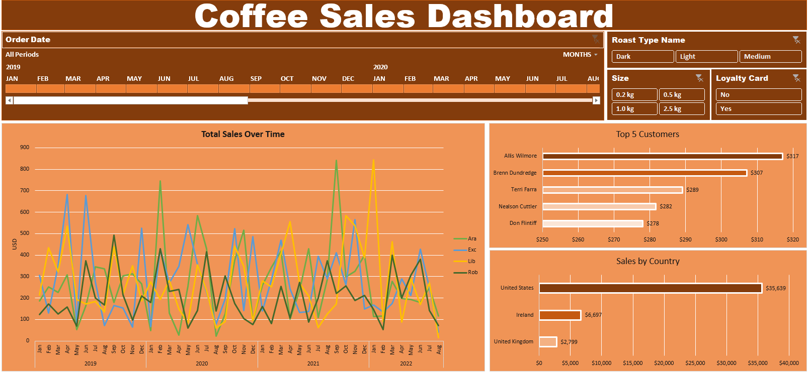

# Project Title: *Coffee Shop Sales Dashboard*

### Data Transformation:
* Data Integration: Integrated Customer name, Email, Country, Coffee Type, Roast Type, Size, Unit Price, sales, and loyalty card into the orders data using functions like VLOOKUP and INDEXMATCH, alongside simple copy-paste operations.
* Price Calculation: Derived sales by multiplying unit price with quantity.
* Data Processing: Extracted day, month, and year from the date using appropriate Excel functions. Standardized the names of roast type and coffee type to their full names. Formatted the date and size column. Converted unit price and sales to dollars. Removed duplicates and converted the range to a table format.

### Insights:
* The United States dominates sales, with a total of $35,639, surpassing Ireland by $28,942.
* Allis Wilmore is the top customer, followed by Brenn Drundredge.
* Sales for all four coffee types experienced a drop in August for the years 2020, and 2022. The highest overall sale was observed in September 2021 (Arabic coffee type) and January 2022 (Liberica coffee type).

#### Tool Utilized: Microsoft Excel
